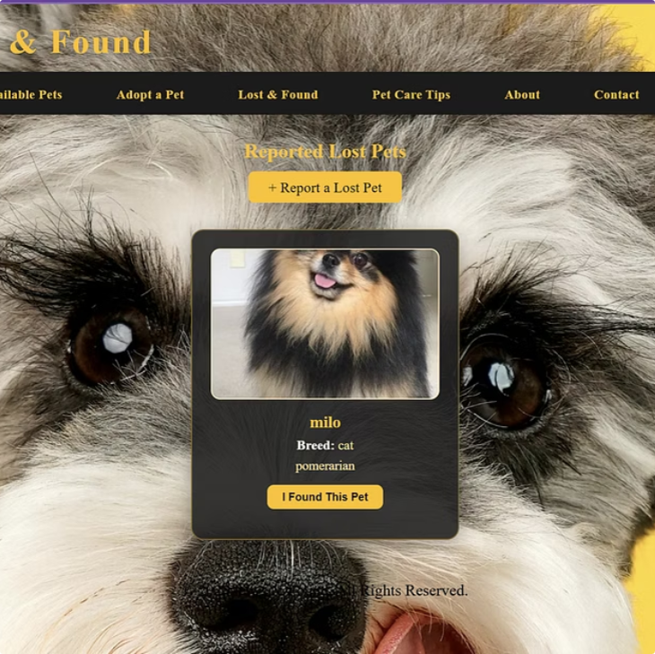

# 🐾 Paws & Found

A web-based **Pet Adoption** and **Lost & Found Management System** developed to connect pet adopters, pet owners, and administrators through a secure and user-friendly platform. The system simplifies pet adoption, lost pet reporting, pet care management, and community engagement by providing a centralized online solution.

---

# 📌 Project Overview

Paws & Found is designed to streamline the process of pet adoption and lost pet reporting. Users can browse pets available for adoption, submit adoption requests, report lost or found pets, explore pet care services, and access helpful pet care information. Administrators manage all records, user requests, pet listings, and reports through a dedicated admin dashboard.

---

# 🎯 Objectives

- Simplify the pet adoption process.
- Provide a centralized lost & found pet reporting platform.
- Improve communication between pet owners, adopters, and administrators.
- Digitize pet management through an intuitive web application.

---

# ✨ Features

## 👤 User Features

- User Registration & Login
- Browse Available Pets
- View Pet Details
- Submit Adoption Requests
- Report Lost Pets
- Report Found Pets
- View Lost & Found Listings
- Pet Care Centre Listings
- Book Pet Care Services
- Donation & Volunteer Information
- Pet Care Tips

## 🔐 Admin Features

- Secure Admin Authentication
- Dashboard Overview
- Manage Pet Listings
- Manage Adoption Requests
- Manage Lost & Found Reports
- Verify Pet Care Centres
- Manage User Information
- Manage Website Content

---

# 🛠 Technologies Used

- PHP
- HTML5
- CSS3
- JavaScript
- MySQL
- XAMPP
- Git & GitHub

---

# ⚙️ System Workflow

1. User registers or logs into the system.
2. Browse pets available for adoption.
3. Submit adoption requests.
4. Report lost or found pets.
5. Access pet care services and information.
6. Administrator reviews and manages all submissions.
7. Pet information and adoption status are updated accordingly.

---

# 📂 Project Structure

```text
Paws-and-Found/
│
├── admin/
├── assets/
├── css/
├── images/
├── includes/
├── js/
├── uploads/
├── index.php
├── login.php
├── register.php
├── pets.php
├── lost_pets.php
├── report_lost.php
├── report_found.php
├── request_adoption.php
├── contact.php
├── donate.php
├── database.sql
└── README.md
```

---

# 🚀 Installation

### Clone the repository

```bash
git clone https://github.com/Taslima-Yeasmin-Oyshi/Paws-and-Found.git
```

### Setup Instructions

1. Install **XAMPP**.
2. Copy the project folder into the **htdocs** directory.
3. Start **Apache** and **MySQL** using the XAMPP Control Panel.
4. Create a new MySQL database.
5. Import the provided SQL database file.
6. Open your browser and navigate to:

```text
http://localhost/Paws-and-Found/
```

---

# 📷 Screenshots

## 🏠 Home Page


---

## 🔑 Login & Register


---

## 🐶 Adoption Request


---

## 📋 Process Adoption Requests


---

## 🔍 Lost & Found



---

## 📝 Lost Pet Reports


---

## 🔒 Secure Admin Login


---

## 📊 Dashboard Overview


---

## ⚙️ Manage Pet Content


---
# 📊 Key Modules

- Pet Adoption Management
- Lost & Found Reporting
- Pet Care Services
- User Authentication
- Admin Dashboard
- Donation & Volunteer Module

---

# ⚠️ Limitations

- No real-time notifications.
- Manual administrator approval process.
- No built-in messaging system.
- Limited mobile responsiveness.
- No location-based pet search.

---

# 🔮 Future Improvements

- Email and SMS notifications
- Advanced search and filtering
- GPS-based lost pet tracking
- Fully responsive mobile interface
- Real-time messaging
- Analytics dashboard
- AI-based pet image matching

---

# 👥 Contributors

- **Taslima Yeasmin Oyshi**
- **Abdullah Al Masum**

**Department of Computer Science & Engineering**  
**Varendra University**

---

# 📄 Project Report

📥 **[View Project Report](Paws_and_Found_Proposal.pdf)**

---

# 📊 Project Presentation

📥 **[View Presentation](Paws-and-Found.pptx)**

---

# 📚 References

- Petfinder
- Adopt-a-Pet
- PawBoost
- PHP Documentation
- MySQL Documentation

---

# 📄 License

This project was developed for **academic and educational purposes** as part of a university software development project.

---

⭐ **If you found this project useful, please consider giving it a star!**
